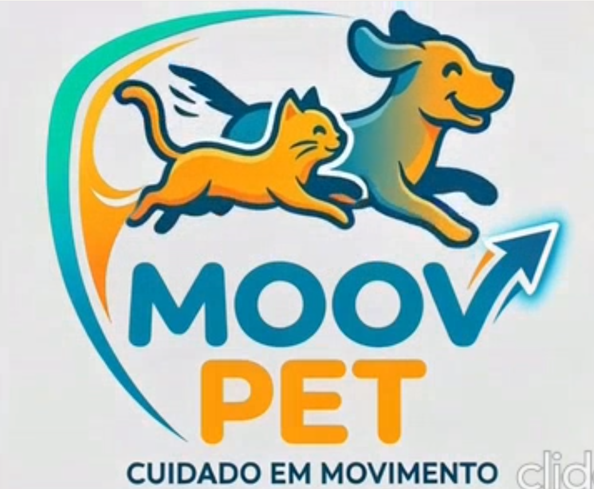

# Projeto Moov Pet

O Moov Pet é uma plataforma para agendamento de serviços veterinários, banho, tosa e venda de produtos premium para animais de estimação

## Índice

-  <a href="#tecutil"> Tecnologias utilidas </a>
-  <a href="#comor">Pré Requisitos e Como rodar </a>
-  <a href="#EstrArq"> Estrutura de Arquivos </a>
- <a ref="#Funcionalidades"> Funcionalidades </a>
- <a href="#Secoesdapg"> Seções da Página </a>

## Tecnologias Utilizadas

🛠️ Tecnologias Utilizadas

HTML5
CSS3 (Flexbox, Grid, variáveis CSS)
JavaScript (ES6+, DOM manipulation)

## Pré Requisitos e Como rodar

🚀 Como Usar

Clone ou faça download dos arquivos do projeto.
Certifique-se de que todos os arquivos de mídia (imagens e vídeo) estão na mesma pasta que o pet.html.
Abra o arquivo pet.html em qualquer navegador moderno.

Não é necessário servidor ou instalação de dependências — o projeto roda diretamente no navegador.

## Estrutura de arquivos 

├── pet.html        # Estrutura principal da página
├── pet.css         # Estilos e layout
├── pet.js          # Lógica interativa (carrinho, formulário, WhatsApp)
├── logo.png        # Logo da Moov Pet
├── petvid.mp4      # Vídeo de apresentação (hero section)
├── racc.jpg        # Imagem — Ração Premium
├── arrann.jpg      # Imagem — Arranhador Torre
├── colg.jpg        # Imagem — Guia Retrátil
├── shamp.jpg       # Imagem — Shampoo Hipoalergênico
├── cons.png        # Ícone — Consultas Veterinárias
├── ban.png         # Ícone — Banho e Tosa
└── hot.png         # Ícone — Hotel Pet

## Funcionalidades

✨ Funcionalidades

🛒 Carrinho de Compras

Botão flutuante no canto inferior direito da tela.
Ao clicar em "Adicionar ao Carrinho", o produto é inserido no painel lateral.
O painel exibe nome, preço e total acumulado dos itens.
Contador de itens atualizado em tempo real no ícone do carrinho.

📬 Formulário de Contato via WhatsApp

Formulário na seção de contato com campos: nome, e-mail, serviço e mensagem.
Ao enviar, a mensagem é formatada e aberta diretamente no WhatsApp do estabelecimento.
Número configurado no arquivo pet.js (variável telefone).

📌 Menu Fixo (Sticky)

Navbar fixa no topo durante a rolagem da página.

## Seções da Página

📱 Seções da Página
SeçãoDescriçãoHeroVídeo de apresentação com slogan da marcaServiçosCards de Consultas, Banho e Tosa e Hotel PetSobreTexto institucional sobre a Moov PetProdutosGrid com 4 produtos em destaque e carrinho integradoContatoFormulário com envio via WhatsAppFooterDireitos reservados e links para redes sociais